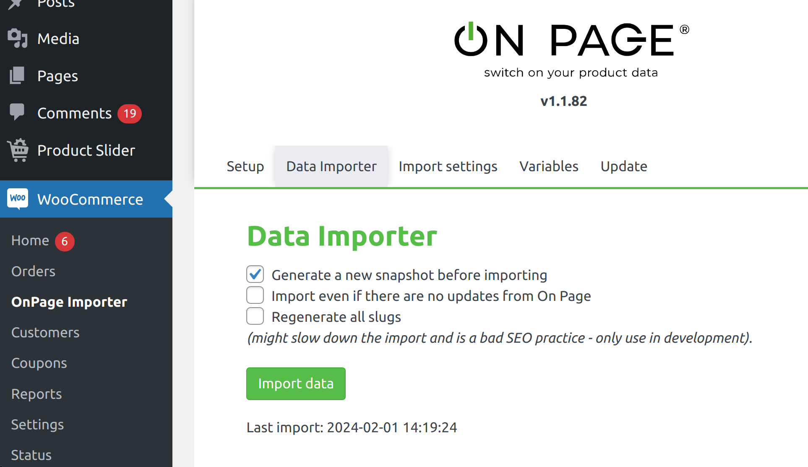

# OnPage WordPress Importer


# Intro
This plugin is used to import an OnPage project snapshot into WordPress. It can target WooCommerce products/categories or configured custom post types and taxonomies. It uses the WordPress tables so you can use imported content the way you are used to. __All field data is saved into the object meta table.__
You can create a project snapshot (and the corresponding token) using the __Snapshot__ feature in OnPage.

## Admin UI

| Menu | Purpose |
|------|---------|
| **WooCommerce → OnPage Importer** or **OnPage → OnPage Importer** | Snapshot token, run imports, field mappings, resource targets, protected terms, file settings, language mapping, plugin update |
| **WooCommerce → OnPage Cron Import** or **OnPage → OnPage Cron Import** | API token for headless/cron imports, live curl and wp-cli command builder |

Importer tabs: **Setup**, **Data Importer**, **Import settings**, **Variables**, **Update**.

All import configuration (except optional developer hooks below) is stored in the database via **Import settings** or **OnPage Cron Import**.

# Handling data
When you import your snapshots, the plugin will generate [Eloquent Models](https://laravel.com/docs/7.x/eloquent) for your data, in the plugin directory `db-models/` these models are updated every time you import your data.

You can view the models generated for your project in the plugin import page. For each model, you'll find the list of relations and fields imported.


## Import settings

All import configuration is managed in **OnPage Importer → Import settings** and stored in the database. When WooCommerce is active, the importer is shown under the WooCommerce menu; otherwise it is shown under a top-level OnPage menu.

### Resource mapping

Use **WordPress resources** to choose, for each OnPage resource:

- **Post / content** — imported into a selected WordPress post type. WooCommerce product fields are enabled only when the selected post type is `product`.
- **Taxonomy term** — imported into a selected WordPress taxonomy.
- **Hidden (thing)** — default for unlisted resources; stored in the plugin's high-performance `op_things` table (invisible to WordPress)

The target post type or taxonomy must already be registered by WordPress, your theme, or another plugin before import.

<details>
<summary>Legacy theme code (deprecated)</summary>

```php
add_filter('op_resource_types', function() {
  return [
    'product' => 'post',
    'category' => 'term',
  ];
});

// Older hook — listed resources become products, all others become categories
add_filter('on_page_product_resources', function() {
  return ['shoes', 't_shirts'];
});
```

</details>

### Parent relations

Use the **WordPress parent** column in **WordPress resources** to link posts and terms:

- **OnPage relation field** — parent resolved from imported data
- **Fixed WordPress term** — every item assigned to one term (that term is protected automatically)

Enable **Link all parent terms** when a post has multiple term relations and you want all of them assigned (default: first only).

<details>
<summary>Legacy theme code (deprecated)</summary>

```php
add_action('op_import_relations', function() {
    return [
        'products' => 'subcategories',
        'subcategories' => 'categories',
    ];
});
```

</details>

### Protected terms

Use **Protected terms** for WordPress terms the import must never update or delete (e.g. hand-made categories not from OnPage). Use primary-language IDs; WPML translations are protected automatically.

<details>
<summary>Legacy theme code (deprecated)</summary>

```php
add_filter('op_static_terms', function() {
  return [1, 2, 3];
});
```

</details>

### File storage

Files and thumbnails are not downloaded during the import process — they are fetched when you first reference them in templates (e.g. `$prod->file('main_image')->link()` or `->thumb(200)`). Later calls use the local cache.

Under **Import settings → Files** you can configure:

- **Serve original files from On Page CDN** — `->link()` returns the On Page URL directly without storing originals on your server (thumbnails are still cached locally).
- **Thumbnail format** — force `png`, `jpg`, or `webp` for generated thumbnails (default: `png`).
- **Store `op_imported_at` meta** — record when each product was last imported.

<details>
<summary>Legacy wp-config constants (deprecated)</summary>

```php
define('OP_DISABLE_ORIGINAL_FILE_IMPORT', true);
define('OP_THUMBNAIL_FORMAT', 'webp');
```

</details>

<details>
<summary>Upgrading from theme code or wp-config</summary>

On plugin upgrade, legacy hooks and constants are auto-migrated into the database. If the importer shows a removal notice, delete the old config from your theme or `wp-config.php` — the database is the only source of truth after migration.

`OP_API_TOKEN` is migrated the same way (migration 74) into **OnPage Cron Import**.

</details>

### Language mapping

Configure in **Import settings → Language mapping** (requires a saved snapshot so OnPage languages are known).

**WPML → OnPage locale mapping** (WPML active only)

- Map each active WPML language to an OnPage language code via dropdowns.
- Use when WPML locale codes differ from OnPage (e.g. WPML `en` → OnPage `en_gb`).
- Unmapped locales still resolve automatically (e.g. `de_de` → `de`).
- Without WPML, WordPress locales are matched to OnPage automatically — no mapping UI.

**Fallback chains** (OnPage project has two or more languages)

- Define, per OnPage language, which other languages to try **in order** when a translation is missing.
- Use the step builder (↑/↓ reorder, add/remove steps).
- If no custom chain is set, the importer tries the country-free variant (e.g. `de` for `de_au`) then the primary OnPage project language.

On upgrade, legacy theme calls are auto-migrated once (migration 75). DB settings are canonical after migration.

<details>
<summary>Legacy theme code (deprecated)</summary>

```php
// Deprecated — use Import settings → Language mapping instead
set_op_locale_to_lang([
  'en_us' => 'en_gb',
]);

op_set_fallback_lang('no', ['en', 'it']);
```

Legacy public functions still exist for migration seeding; the importer shows a removal notice if theme code still calls them. Runtime reads DB via internal `op_internal_*` helpers only.

</details>


## Selecting data
For instance, assuming you want to select all your products (codenamed `Product`), you can run:
```php
$prods = Op\Product::get(); // a collection of products
```

By default, no ordering is used (fastest method).
The order is only applied when accessing relations (e.g. `$product->variants()->get()`), and not for global order.
If you need to maintain On Page global order, you should also add `->sorted()` to the query like so:
```php
$prods = Op\Product::sorted()->get(); // a collection of products sorted with the global ordering
```

You can also sort results by field value:
```php

$prods = Op\Product::orderByField('price')->get();

// Sort in descending order:
$prods = Op\Product::orderByField('price', 'desc')->get();
```

### Getting record values
You can get each record values through the `->val(field_name, language)` function:
```php
foreach ($prods as $prod) {
  // get the name in the current language - will fallback on the primary language if no translation is found
  echo $prod->val('name')."<br>\n";
  
  // get the name in a custom language - will never fallback on other languages
  echo $prod->val('name', 'zh')."<br>\n";
  
  // get the name in the current language, disabling fallback
  echo $prod->val('name', false)."<br>\n";
  
  // access relation values (will return the value from the first relation)
  echo $prod->val('category.name')."<br>\n";
  // Gets a file name
  echo $p->file('info_file')->name; // e.g. MK100.pdf
  // Gets the original image/file url
  echo '<a href="'. $p->file('info_file')->link() .'">Download PDF</a>'
  // This will generate open the file in the browser instead of downloading it
  echo '<a href="'. $p->file('info_file')->link(true) .'">Open PDF</a>'
  // Resize image to width 100 and automatic height (generated in run-time and cached)
  echo 'file('cover')->thumb(100) .'">'
  // Generate thumbnail cropping (zooming) the image
  echo 'file('cover')->thumb(200, 100) .'">'
  // Generate thumbnail containing (out-zooming) the image
  echo 'file('cover')->thumb(200, 100, true) .'">'

  // You can get information about the files:
  $file = $p->file('cover');
  $file->getWidth();
  $file->getHeight();
  $file->getAverageColor();

  // Get all variant colors
  $available_colors = $p->getRelatedItems('variants.colors');

  // Get the product category passing by the subcategory
  $cat = $p->getRelatedItems('subcategory.category')->first();
```

### Pluck field values
You can use the `pluckField` method to pluck a single field from the query:
```php
$prods = Op\Product::pluckField('name'); // ['Product A', 'Product B', 'Product C']
```

__NOTE:__ All the above functions will return the value __as is__, so if the name contains special characters, they will __not__ be returned as HTML entities (`&` becomes `&amp;`). You have the responsibility to escape the output with functions such as `htmlentities` or the shorthand `op_e($string)`.

__NOTE:__ All the above functions will return an array of values if the field is set to multiple.


### Accessing folders
In On Page you can create field folders, and mark them as "default"
for any element you have.
You can easily access the folder name and the folder fields just like in the following example:
```php
// Not all items have a default folder set, so be careful!
if ($folder = $prod->getDefaultFolder()) {
    echo "Default folder: ";
    // show the translated folder label
    echo op_label($folder);
    echo "<br>";

    // Get the fields in this folder
    foreach ($folder->fields as $field) {
      // show the translated field label
        echo op_label($field);
        echo ": ";

        // use the field name to access the item values
        echo $prod->val($field->name);
        echo "<br>";
    }
    // echo "<hr>";
}
```

### CDN support
On Page supports uploading files to external CDNs.
You can get the image url from the CDN simply calling `$p->file('info_file')->cdn()`.
If you use multiple CDN, you can specify the CDN name like so: `$p->file('info_file')->link('my_custom_cdn')`.

## Filtering data
You can use all the eloquent methods to filter your data, but because the fields are stored inside the meta table, we provide some helper functions as follow:
```php
// Get the first chapter named "Boats"
$prods = Op\Chapter::whereField('name', 'Boats')->first()
// Get all the elements longer than 10cm
$prods = Op\Chapter::whereField('length', '>', 10)->get()
// Get elements using in operator
$prods = Op\Chapter::whereFieldIn('name', ['Boats', 'Spacecrafts'])->get()
// Full text search in all the fields (will search for %boa% in all fields)
$prods = Op\Chapter::search('boa')->get()
// Full text search only in some attributes
$prods = Op\Chapter::search('boa', ['name', 'description'])->get()
// Filter by related items (get products that have a color in the category "Dark colors")
$prods = Op\Product::whereField('colors.category.name', 'Dark colors')->get();

// Filter by On Page ID
$prods = Op\Product::whereField('_id', 1872378)->get();

// Filter by Wordpress ID
$prods = Op\Product::whereField('_wp_id', 6123)->get();

// Join filters using OR
$prods = Op\Product::where(function($q) {
  $q->whereField('length', '>', 10);
  $q->orWhereField('height', '>', 10);
})->get();

// Use deep where to customize the final query
$prods = Op\Product::deepWhere('colors.category', function($q) {
  $q->whereField('name', 'Dark colors');
})->get();
```

## Relations
You can easily access related elements using the relation name
```php
// Get all the products for the given category
$products = $category->products;
// Query all the products
$products = $category->products()->search('MK1')->get();
```


## Eager loading
All the query seen so far automatically preload all the meta attributes, to reduce the amount of stress on the database.

```php
// the following line runs two queries, one for the products on wp_posts, the second to fetch all the metadata on wp_post_meta
$prods = Op\Product::all();
```


### Relations
The related elements are not preloaded, so the following code will result in 2 + N*2 queries where N is the number of products.
```php
$prods = Op\Product::all();
foreach ($prods as $p) {
  foreach ($p->colors as $p) {
    echo $p->val('name')."<br>";
  }
}
```
To reduce the number of queries, you can easily preload the related elements (this only produces 2 or 4 queries - depending on whether the relation is `post->post`/`term->term`, or `post->term`/`term->post`):
```php
$prods = Op\Product::with(['colors'])->get();
foreach ($prods as $p) {
  foreach ($p->colors as $p) {
    echo $p->val('name')."<br>";
  }
}

// You can preload as much data as you need:

$prods = Op\Product::with([
  'colors',
  'subcategory.category',
  'variants.colors',
])->get();
```

### Schema - Resources & Fields
The schema is the structure of the data, it is composed by an array of resources, which in turn contain an array of fields.

```php
// Iterate all available resources and fields
foreach (op_schema()->resources as $res)
  echo $res->name;
  echo op_label($res); // resource label in current language
  echo op_label($res, 'it'); // resource label in custom language

  // Iterate resource fields
  foreach ($res->fields as $field) {
    echo $field->name;
    echo $field->type; // string | text | int | real | file | image | ...
    echo $field->unit; // cm | kg | W | ...
    echo op_label($field); // field label in current language
    echo op_label($field, 'it'); // field label in custom language

    echo op_description($field); // field description in current language
    echo op_description($field, 'it'); // field description in custom language
  }
}

// Find resource by name
$res = op_schema()->name_to_res['colors'];

// Find field by name
$field = $res->name_to_field['description'];

// Access field folders in a resource
foreach ($res->field_folders as $folder) {
  echo op_label($folder);
  foreach ($folder->fields as $field) echo op_label($field);
}
```


# Templating
You can use the normal woocommerce templating system as you're used to.
The only thing you need is to obtain an instance of the eloquent model.
You can easily do so by using the following functions:
```php
// To retrieve the model from a term
op_category('slug', 'the-category-slug'); // will return an instance to Op\MyCategory

// To retrieve the model from a post
op_product('ID', 123); // will return an instance to Op\MyProduct

// Notice you can use any column name as the first argument
$cat = op_category('term_id', 123);
$cat->getResource()->name; // 'my_category'
$cat->val('name'); // 'The Category Name'
$cat->products; // A collection of products
```


# Hooks

Optional developer hooks not covered by Import settings (slug customization). Language mapping and fallback chains are configured in the UI — see **Language mapping** above.

## Import completed
A hook called whenever an import has completed, you can use it to regenerate the cache of the website.

```php
add_action('op_import_completed', function() {
  clear_my_caches();
  notify_admin();
});
```

## Slug customization for categories and products
By default, slugs are generated using the format "ID-NAME-LANG". To customize how the slugs are generated,
you can use the `op_gen_slug` function as follows.
NOTE: Slugs for existing items do not get updated unless you tick the "Force slug regeneration" option in the import panel.

In the `op_gen_slug` you can return any string (e.g. "My Product"), and the plugin will convert it to its slug form (e.g. "my-product").
If `null` is returned, the original slug is used.

```php
add_action('op_gen_slug', function($item) {
    
    if ($item instanceof \Op\Product) {
        return "{$item->val('name')}-{$item->val('titolo')}";
    } else if($item instanceof \Op\Category) {
        return "{$item->val('description')}";
    } else if($item instanceof \Op\Color) {
        return "{$item->val('name')}";
    } else {
      // Generic handler
      return "{$item->val('nome')}";
    }
});

```


# Advanced language options

Runtime behaviour for templates and import:

- **Current language** — from WPML (`ICL_LANGUAGE_CODE`) or WordPress `get_locale()`, then mapped via DB `locale_to_lang` when WPML mappings exist.
- **`->val('field')`** — uses `op_fallback_langs()` for translatable fields; order matters when custom chains are configured in the UI.

Default fallback (no custom chain): current OnPage language → country-free variant → primary OnPage project language.

Legacy PHP APIs (`set_op_locale_to_lang`, `op_set_fallback_lang`) are deprecated — configure in **Import settings → Language mapping** instead.


# Example templates
## Shop Page
```php
<?php
foreach (Op\Category::all() as $cat): ?>
  <a href="<?= $cat->permalink() ?>">
    <?= $cat->val('name') ?>
  </a>
<?php endforeach; ?>

```

## Category Page
```php
$category = op_category('slug', $term->slug);
<h1><?= $category->val('name') ?></h1>
<?php
foreach ($category->products as $prod): ?>
  <a href="<?= $prod->link() ?>">
    <?= $prod->val('name') ?>
  </a>
<?php endforeach; ?>

<?php get_footer(); ?>
```

## Product Page
You should understand the way it works by now. Simply use the `->link()` method to get the link to the item.

# Automate imports

Scheduled imports can run via **HTTP + API token** (remote cron) or **WP-CLI** (on the server). Both are configured from **WooCommerce → OnPage Cron Import**.

## API token

1. Open **WooCommerce → OnPage Cron Import**.
2. Click **Generate token** (or **Regenerate token** to rotate an existing one).
3. Copy the token or use the generated commands below.

The token is stored in the database. Use **Disable token** to turn off HTTP cron auth. Regenerating or disabling invalidates any cron jobs still using the old token.

<details>
<summary>Legacy: <code>OP_API_TOKEN</code> in wp-config.php (deprecated)</summary>

If you previously defined a token in `wp-config.php`, it is copied to the database once on upgrade (migration 74), then ignored at runtime:

```php
define('OP_API_TOKEN', '0T780347N89YGA78EYN');
```

Remove the constant after migrating — use **OnPage Cron Import** instead.

</details>

## Import options and command builder

On the **OnPage Cron Import** page, use the **Import options** checkboxes to include optional flags in the curl and wp-cli examples:

| Option | curl parameter | wp-cli flag | Description |
|--------|----------------|-------------|-------------|
| *(none checked)* | — | — | Recommended for cron: import only when a new snapshot is available |
| regen-snapshot | `regen-snapshot=true` | `--regen-snapshot` | Generate a new snapshot before importing |
| force | `force=true` | `--force` | Import even if there are no updates from On Page |
| force-slug-regen | `force-slug-regen=true` | `--force-slug-regen` | Regenerate all slugs (development only; bad for SEO) |

The page updates both commands live as you toggle options. Use **Copy curl command** or **Copy wp-cli command** when ready.

### Minimal cron (recommended)

With all options unchecked, a typical cron entry looks like:

```bash
curl -X POST 'https://yourwebsite/?op-api=import&op-token=YOUR_TOKEN'
```

Or on the server:

```bash
wp onpage import
```

By default, __the import exits instantly if there is no new data to be imported__. Safe to run every minute — it only imports when On Page has a new snapshot.

### Example with options enabled

If you enable **regen-snapshot** and **force**:

```bash
curl -X POST 'https://yourwebsite/?op-api=import&op-token=YOUR_TOKEN&regen-snapshot=true&force=true'
wp onpage import --regen-snapshot --force
```

### HTTP parameters reference

| Parameter | Required | Description |
|-----------|----------|-------------|
| `op-api` | yes | Set to `import` |
| `op-token` | yes | Your API token from **OnPage Cron Import** |
| `regen-snapshot` | no | `true` to refresh the snapshot before importing |
| `force` | no | `true` to re-import even without new data |
| `force-slug-regen` | no | `true` to regenerate slugs (development only) |

Request method: **POST**.

## Other wp-cli commands

```bash
wp onpage reset      # Delete all posts and terms managed by the plugin for configured targets
wp onpage listmedia  # List imported media files
wp onpage update     # Update the plugin
wp onpage cleanmeta  # Delete orphaned meta
```

# Important Notes
- Functions and other plugin methods that are not documented here are subject to change and therefore should not be used.
- The plugin will modify the posts and terms table and add some custom columns
